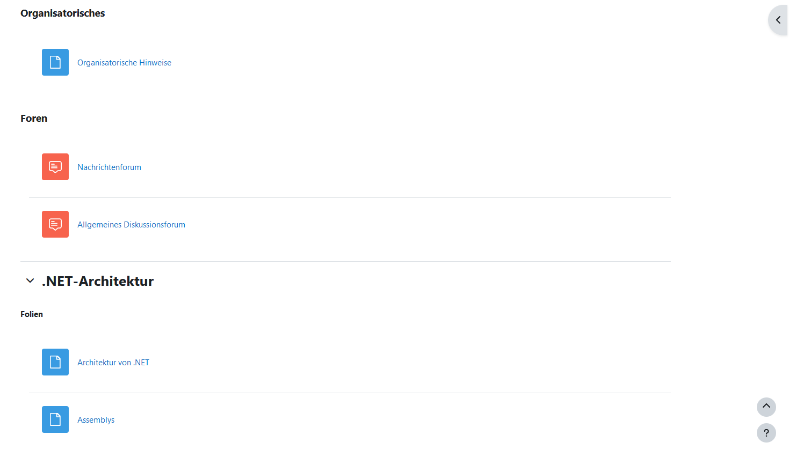
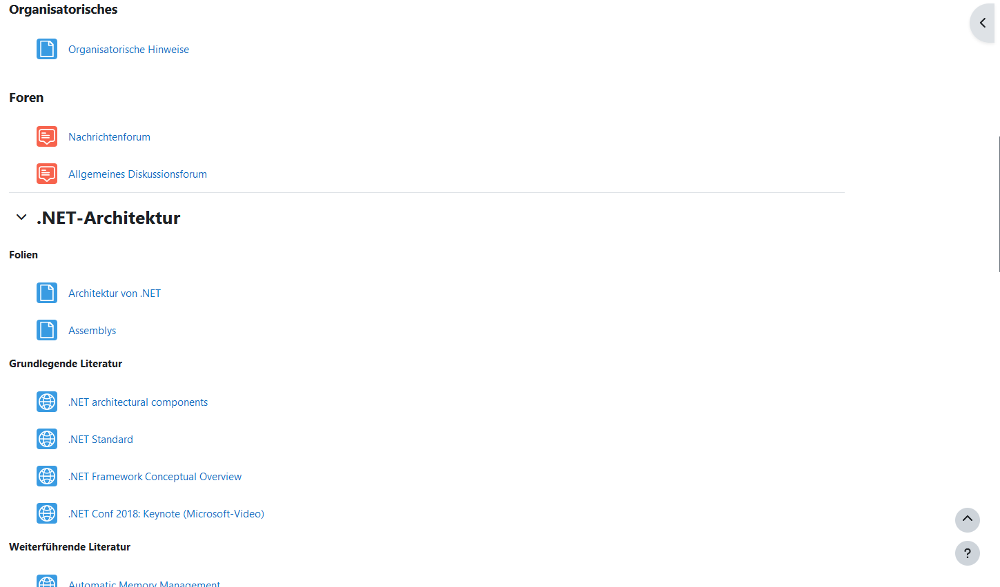

# UnfckMoodle-Firefox
Makes the new version of the online learning platform moodle a little less terrible.

Please note that this version only works for Mozilla Firefox.

## How to install

- Download the `UnfckMoodle-Firefox.zip` archive and extract the file.
- Open the previously extracted file with Mozilla Firefox.
- When prompted whether to add the new extension, click `Add`. 

## Before/After Comparison

### Before

### After

